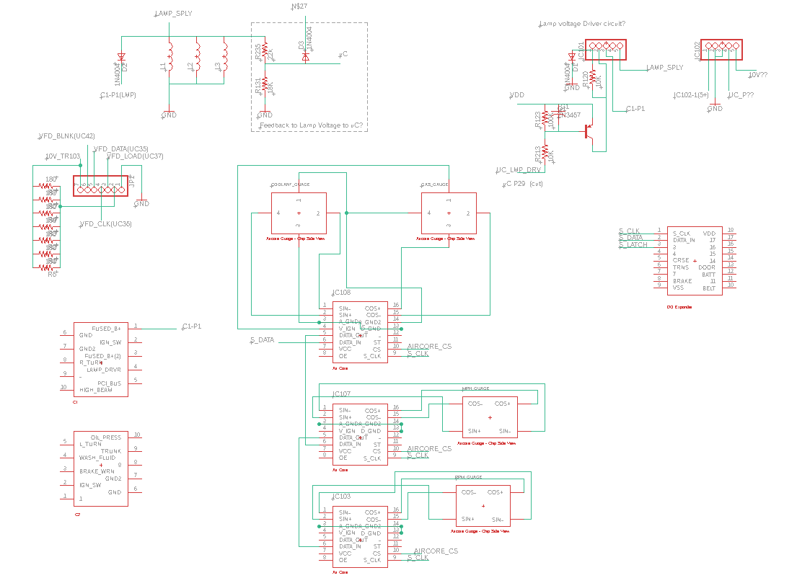

# _ESP_Dashboard_  

_This project uses the ESP8266 hspi Master to drive a 2004 Dodge Intrepid Dashboard._

## How to use  

### Hardware Required  
* 2004 Dodge Intrepid Instrument Panel
* Connection:  

| Signal    | Intrepid  |ESP8266|
|-----------|-----------|-------|
| 3.3V      | NC		| VCC	|
| SCLK      | D0(SCL)   | GPIO14|
| VFDCLK	| VFDCLK	| Trans	| 
| MOSI      | VFD/GLDATA| GPIO13|
| Gauge CS  | Gauge CS  | GPIO16|
| Light Pls | Light Pls | GPIO12|
| VFD Pls	| VFD Pls	| GPIO02|
| GND       | GND       | GND   |

### Configure the project  

```
make menuconfig
```

* Set serial port under Serial Flasher Options.


### Build and Flash  

Build the project and flash it to the board, then run monitor tool to view serial output:

```
make -j4 flash monitor
```

(To exit the serial monitor, type ``Ctrl-]``.)

See the Getting Started Guide for full steps to configure and use ESP-IDF to build projects.

## Example Output  

* LOG:  

```
I (233) spi_oled: init gpio
I (235) gpio: GPIO[12]| InputEn: 0| OutputEn: 1| OpenDrain: 0| Pullup: 1| Pulldown: 0| Intr:0
I (239) gpio: GPIO[15]| InputEn: 0| OutputEn: 1| OpenDrain: 0| Pullup: 1| Pulldown: 0| Intr:0
I (251) spi_oled: init hspi
I (257) spi_oled: init oled
```

* Intrepid Schematic (Not Complete):  

    